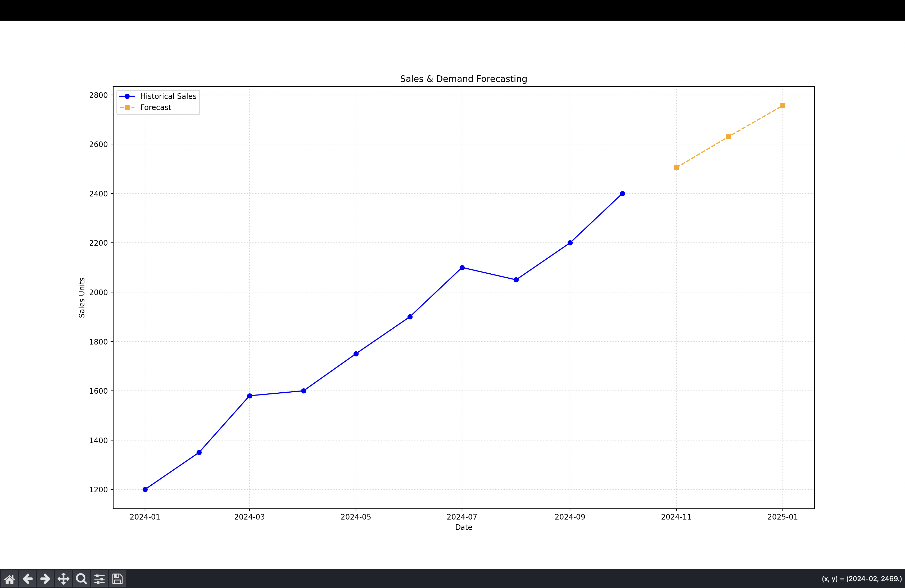

# Sales & Demand Forecasting for Businesses

## Project Overview
This project implements a Machine Learning solution to forecast future product demand and sales based on historical business data. By leveraging time-series analysis and regression techniques, the system helps businesses optimize inventory, manage supply chains, and make data-driven financial decisions.

---

## Key Features
* **Time-Series Engineering:** Converts raw date information into meaningful numerical features for model training.
* **Trend Analysis:** Identifies underlying growth or decline patterns in historical data.
* **Predictive Modeling:** Uses Linear Regression to project sales for upcoming months.
* **Performance Metrics:** Evaluates accuracy using Mean Absolute Error (MAE) and R-squared (R²) scores.
* **Data Visualization:** Provides clear graphical comparisons between historical trends and forecasted demand.

---

## Tech Stack
* **Language:** Python
* **Libraries:** Pandas, NumPy, Scikit-learn
* **Visualization:** Matplotlib
* **Environment:** Jupyter Notebook / Python Script

---

## How It Works
1. **Data Preprocessing:** Historical sales records are cleaned and indexed by date.
2. **Feature Extraction:** Time-based steps are created to serve as independent variables.
3. **Training:** A regression model is fitted to the historical data to "learn" the sales trajectory.
4. **Forecasting:** The model predicts values for future time steps.

---

## Visual Results
Below is the trend analysis generated by the model, showing the historical data versus the future forecast.

---

## Installation & Usage
1. Clone the repository:
   `git clone https://github.com/shannu-pixel/FUTURE_ML_01.git`
2. Install dependencies:
   `pip install pandas numpy matplotlib scikit-learn`
3. Run the script:
   `python Task1.py`
